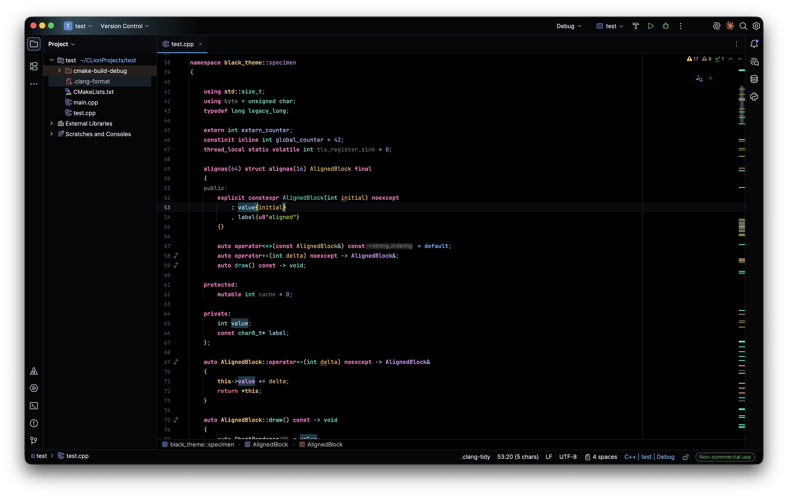

# Real Black for CLion

Real Black is a pitch-black JetBrains IDE theme tuned for CLion. It keeps the editor genuinely black, gives the IDE shell an Islands Dark-inspired shape, and adds a custom C++ color scheme with extra semantic highlighting for keywords and common C++ declarations.

This project is fully vibe coded: designed, iterated, and implemented through conversational AI collaboration.

## Why Real Black

Most dark themes are not actually black. Real Black is for people who want a true-black CLion workspace without giving up readable C++ syntax, visible file status colors, and a polished IDE UI.

## Highlights

- Real black editor and dark UI surfaces.
- Islands Dark-inspired tool windows, lists, project tree spacing, and status colors.
- Custom C++ editor color scheme for stronger distinction between keywords, types, variables, parameters, templates, namespaces, functions, and trailing return types.
- Extra annotator for C++ tokens that CLion normally groups together.
- Bright file status colors for modified and new files.
- Installable JetBrains plugin ZIP built from this repository.

## Screenshots



Real Black in CLion with the C++ color specimen open, Project tool window visible, and identifier occurrence highlighting active.

More screenshots can be added using the checklist in [docs/screenshots/README.md](docs/screenshots/README.md).

## Install From Disk

1. Build the installable archive:

   ```bash
   ./scripts/package.sh
   ```

2. In CLion, open `Settings | Plugins`.
3. Click the gear icon, choose `Install Plugin from Disk...`, and select:

   ```text
   dist/real-black-1.0.0.zip
   ```

4. Restart CLion when prompted.
5. Open `Settings | Appearance & Behavior | Appearance` and choose `Real Black`.

## Install From GitHub Releases

Download the prebuilt plugin ZIP from GitHub Releases:

[real-black-1.0.0.zip](https://github.com/nazimaraz/real-black-clion-theme/releases/download/v1.0.0/real-black-1.0.0.zip)

Then install it in CLion:

1. Open `Settings | Plugins`.
2. Click the gear icon.
3. Choose `Install Plugin from Disk...`.
4. Select the downloaded `real-black-1.0.0.zip`.
5. Restart CLion when prompted.
6. Open `Settings | Appearance & Behavior | Appearance` and choose `Real Black`.

Do not unzip the archive before installing it. If the download link returns `404`, the GitHub Release exists but the plugin ZIP has not been uploaded as a release asset yet.

## C++ Colors

The theme uses CLion's built-in C/C++ color keys for namespace names, type names, template names, variables, parameters, punctuation, functions, macros, comments, strings, and numbers.

It also adds a small annotator so specific keywords can be distinct even when CLion groups them under the same default keyword bucket:

- `namespace`
- `auto`
- `const`
- `constexpr`, `consteval`, `constinit`
- `template`, `typename`
- built-in and declaration type keywords
- owner types and callable names in out-of-class definitions, such as `ChartRenderer::draw`
- trailing return types after `->`

Open [examples/cpp-theme-color-specimen.cpp](examples/cpp-theme-color-specimen.cpp) in CLion to inspect the palette across a wide C++ feature sample.

## Project Layout

- [src/main/resources/themes/RealBlack.theme.json](src/main/resources/themes/RealBlack.theme.json): IDE UI theme colors.
- [src/main/resources/schemes/RealBlack.xml](src/main/resources/schemes/RealBlack.xml): editor and console colors.
- [src/main/resources/META-INF/plugin.xml](src/main/resources/META-INF/plugin.xml): plugin metadata.
- [src/main/java/dev/nazimaraz/realblack/BlackCppKeywordAnnotator.java](src/main/java/dev/nazimaraz/realblack/BlackCppKeywordAnnotator.java): extra C++ keyword coloring.
- [examples/cpp-theme-color-specimen.cpp](examples/cpp-theme-color-specimen.cpp): C++ color coverage specimen.
- [scripts/package.sh](scripts/package.sh): local package builder.

## Development

Run the local packager after editing:

```bash
./scripts/package.sh
```

The package script uses `/Applications/CLion.app/Contents` by default. To point it at another CLion installation:

```bash
CLION_HOME="/path/to/CLion.app/Contents" ./scripts/package.sh
```

This repository also includes a Gradle build file for normal JetBrains plugin development. If Gradle is available, `gradle buildPlugin` can be used instead of the manual package script.

## Release

See [docs/release.md](docs/release.md) for the release checklist.

Short version:

1. Bump the version in [build.gradle.kts](build.gradle.kts) and [src/main/resources/META-INF/plugin.xml](src/main/resources/META-INF/plugin.xml).
2. Update [CHANGELOG.md](CHANGELOG.md).
3. Run `./scripts/package.sh`.
4. Upload the generated `dist/real-black-*.zip` file to a GitHub Release.

The `dist/` directory is intentionally ignored by Git. Release ZIPs should be attached to GitHub Releases rather than committed.

## Contributing

Contributions are welcome. See [CONTRIBUTING.md](CONTRIBUTING.md) for local setup and contribution notes.

## License

Real Black is released under the [MIT License](LICENSE).
